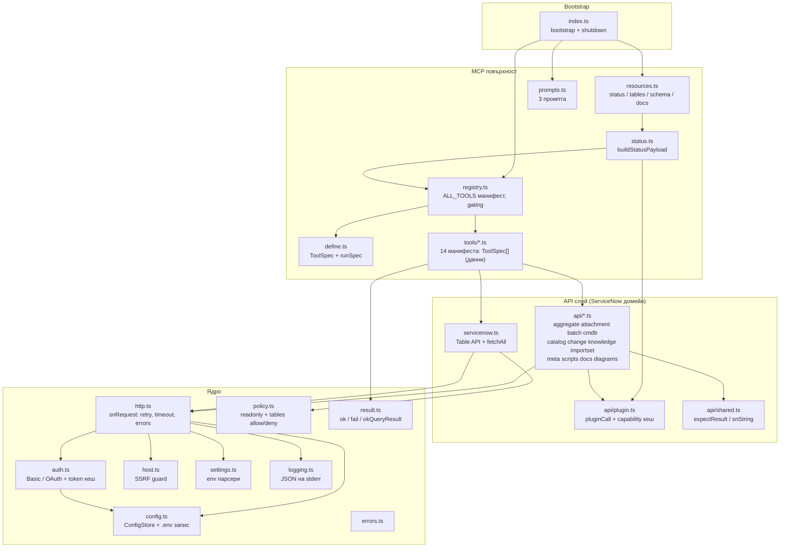
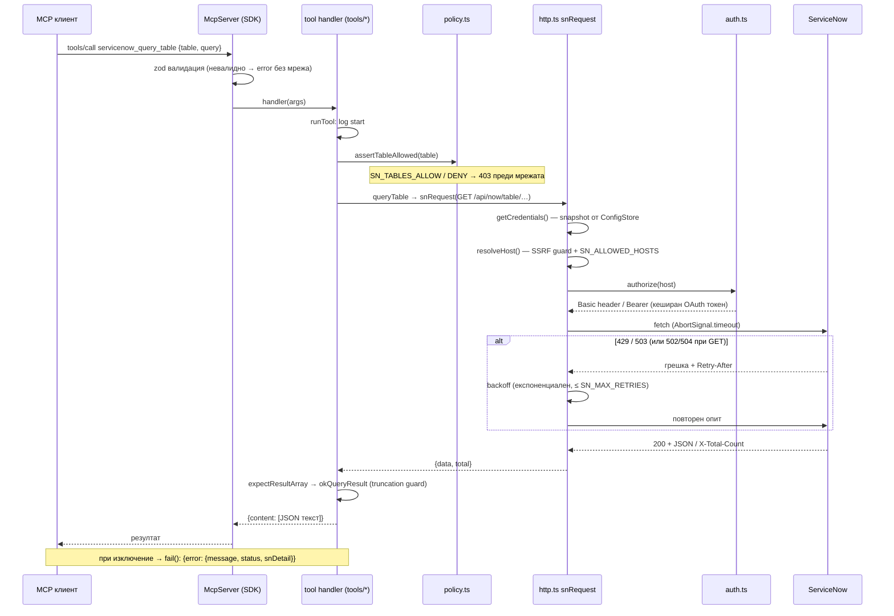
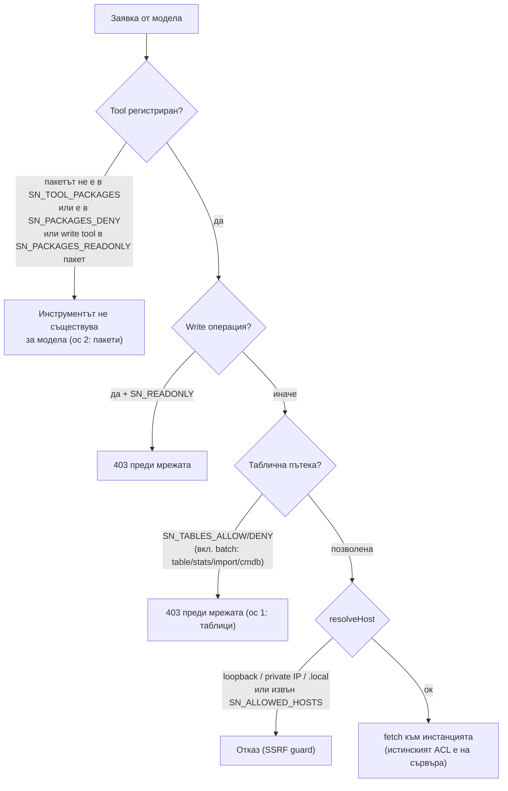
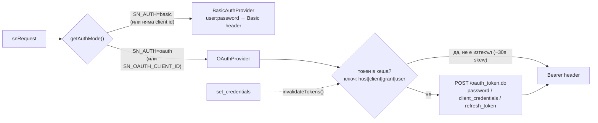
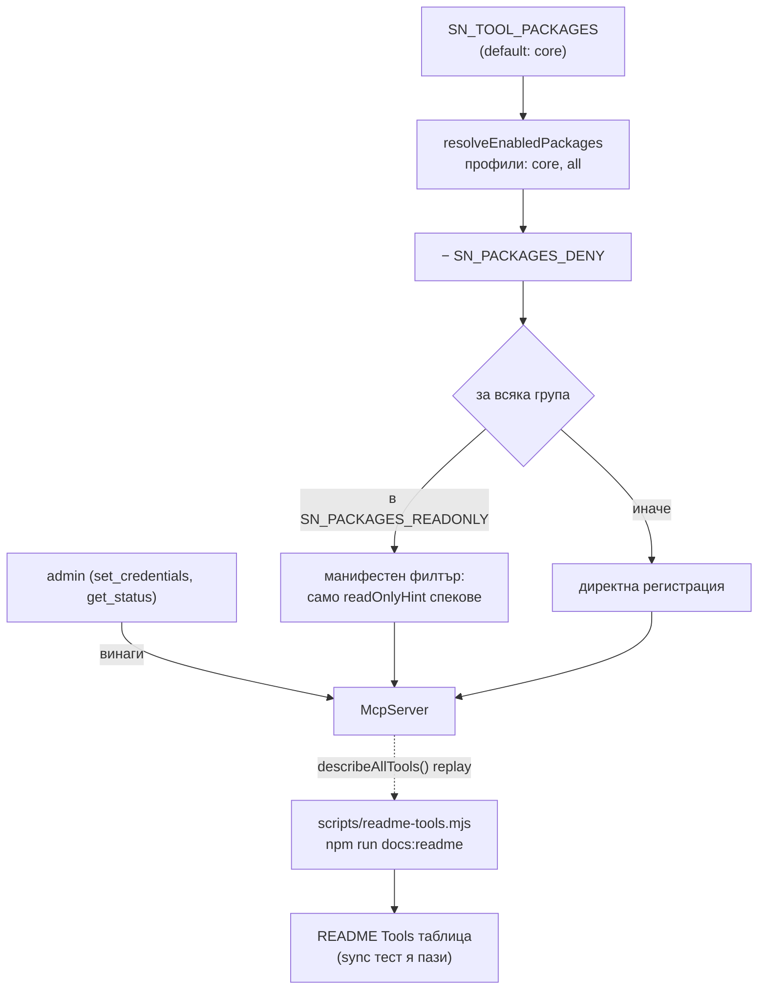

# Sincronia — Архитектурна документация

Дата: 2026-06-12 · Отразява кодa след пълната имплементация на ревюто (107/107 теста, commit `7877dff`).
Свързани документи: [PRODUCT-STATE.md](PRODUCT-STATE.md) (състояние), [IMPLEMENTATION-PLAN.md](IMPLEMENTATION-PLAN.md) (бъдеще), [DONE.md](DONE.md) (история), [WORKLOG.md](WORKLOG.md) (хронология).

## 1. Какво е Sincronia

TypeScript **stdio MCP сървър** за ServiceNow: LLM клиент (Claude, VS Code Chat, Inspector…) получава 46 инструмента върху ServiceNow REST повърхността — Table, Aggregate, Attachment, Import Set, Batch, Service Catalog, Change Management, Knowledge, CMDB/IRE, script intelligence, Mermaid генератори и локална само-документация. Един процес, нула външни runtime зависимости освен `@modelcontextprotocol/sdk`, `zod` и `dotenv`; целият вход/изход е JSON по stdio (логовете са само на stderr).

Принципи, които държат дизайна:

1. **Един HTTP клиент** — всичко минава през `snRequest()` (auth, SSRF guard, timeout, retry, error mapping се правят веднъж).
2. **Policy в клиента (defense in depth)** — ограниченията (read-only, таблици, пакети) се налагат _преди_ мрежата, не разчитаме само на ACL-ите на инстанцията.
3. **Кодът е източникът на истина** — README таблицата на tools се генерира от регистрациите; sync тест пада при изоставане.
4. **Тестове без мрежа** — целият suite (107) върви върху mock `fetch` + in-memory MCP транспорт.

## 2. Слоеве и модули

Бележки:

- `tools/*` са **данни**: всеки файл изнася `specs: ToolSpec[]` (име/докс/пакет/annotations/zod вход/handler); `mcp/define.ts#runSpec` дава uniform логване/грешки. Пакет се вкарва/изкарва с един spread в `ALL_TOOLS`. Домейнната логика живее в `api/*`.
- Слоевете се налагат машинно (ESLint no-restricted-imports зони, М-2); лек остатъчен цикъл `registry → tools/admin → status → registry` работи в ESM (употреби само на ниво извикване).
- Целевото преструктуриране (Фаза 6 М-1/М-2): `core/` + `api/` + `mcp/` директории — местене на готови модули, без промяна на зависимостите по-горе.

## 3. Жизнен цикъл на една заявка

Ключови детайли:

- **Retry матрица:** 429/503 се повтарят за всички методи; 502/504 и transport грешки — само за GET (изходът от write е неизвестен → не дублираме мутации). `Retry-After` се уважава и като секунди, и като HTTP дата.
- **Труднати резултати:** `okQueryResult` реже записите наполовина итеративно докато се събере в `SN_MAX_RESULT_CHARS`, с обяснителна бележка как да се стесни заявката.

## 4. Модел на сигурност (две оси + мрежови guard-ове)

- **Ос 1 — таблици** (`SN_TABLES_ALLOW`/`SN_TABLES_DENY`): пази Table API, CMDB класове, Import Set и batch под-заявките (вкл. `stats`/`import`/`cmdb/instance` URL-и).
- **Ос 2 — пакети** (`SN_PACKAGES_DENY`/`SN_PACKAGES_READONLY`): единственият начин да се ограничат plugin API-тата (catalog/change/knowledge…), които нямат таблична пътека. Read-only пакет = write инструментите изобщо не се регистрират (Proxy фасада по `readOnlyHint`).
- **Глобално:** `SN_READONLY` блокира всички мутации; SSRF guard-ът няма opt-out за вътрешни адреси.
- **Съзнателно извън обхват (won't-fix, решение на собственика):** правата на `.env` файла (0644) и възможността `set_credentials` да сменя хоста (митигирано от SSRF guard + `SN_ALLOWED_HOSTS`; Фаза 6 Х-2 добавя клиентска конфирмация).

## 5. Автентикация

Паролата не участва в ключа на кеша → смяната на креденшъли изрично чисти кеша (`invalidateTokens()`), за да не надживее токен старите тайни.

## 6. Конфигурация

- **Env-first:** стойности, подадени от MCP клиента, винаги печелят (`dotenv` с `override:false`); `.env` се търси в ред `SN_ENV_FILE` → XDG (`~/.config/sincronia-mcp/.env`) → project root.
- **ConfigStore (креденшъли):** env-ът е само _начален_ източник — първото четене прави immutable snapshot; `saveCredentials` записва файла атомарно (temp + rename), обновява `process.env` (за child процеси) и сменя snapshot-а с едно присвояване. Недовършено четене „нов user + стара парола“ е структурно невъзможно. Това е опорната точка за мулти-инстанс профилите (Фаза 7 MI-1).
- **Всички настройки** (timeout, retries, лимити, пакети, лог ниво) се четат през `settings.ts` с валидиращи парсери и документирани default-и (README env таблица + `.env.example`).

## 7. Tool пакети и регистрация

`core` профил = table + schema + aggregate + attachment (15 tool-а); `all` = всичките 13 пакета (46). `effectivePackages()` е единственият източник на истина — ползва се от регистрацията, от status payload-а и от генератора.

## 8. Грешки и резултати

- Всички tool отговори са JSON текст: `ok(data)` / `okQueryResult(records, total)` (с truncation) / `fail(error)`.
- `fail` пази структурата на `ServiceNowError`: `{ error: { message, status, snDetail } }` — моделът реагира различно на 401 (креденшъли), 403 (policy/ACL), 429 (rate limit).
- `pluginCall` превежда най-подвеждащата ServiceNow грешка: 404 за цял namespace (= неактивен plugin) се отличава от 404 за липсващ запис; namespace вариантът се кешира 5 минути (fail-fast без мрежа) и се вижда в `pluginApis` на статуса.

## 9. Тестова архитектура

| Ниво                   | Файлове                                                                                                                                                                                        | Какво пази                                                                               |
| ---------------------- | ---------------------------------------------------------------------------------------------------------------------------------------------------------------------------------------------- | ---------------------------------------------------------------------------------------- |
| Чисти unit             | `config.test`, `settings.test`, `result.test`, `logging.test`, `servicenow.test` (host)                                                                                                        | env парсери, .env round-trip, truncation, SSRF, лог филтър                               |
| api/ върху mock fetch  | `http.test`, `http-retry.test`, `fetchall.test`, `auth.test`, `batch.test`, `phase3.test`, `scripts.test`, `meta.test`, `attachment.test`, `diagrams.test`, `plugin.test`, `config-store.test` | домейнната логика + retry/policy/кешове, нула мрежа                                      |
| MCP повърхност         | `mcp-smoke.test` (SDK Client + `InMemoryTransport`)                                                                                                                                            | zod схеми, мапинг на аргументи, пликове, package gating, **контрактен snapshot на core** |
| Документационни пазачи | `readme-sync.test`, `packages.test`                                                                                                                                                            | README ↔ код синхрон; пакетната резолюция                                                |

Общи helpers (`test/helpers.js`): `baselineEnv` / `withEnv` (snapshot/restore на env + reload на ConfigStore), `withFetch` (подмяна на global fetch със записани извиквания), `jsonResponse`.

## 10. Ключови дизайн решения (съкратени ADR)

| #   | Решение                                              | Защо                                                                            | Алтернатива (отхвърлена)                              |
| --- | ---------------------------------------------------- | ------------------------------------------------------------------------------- | ----------------------------------------------------- |
| 1   | stdio транспорт, stdout само за протокола            | най-простата интеграция с MCP клиенти                                           | HTTP транспорт — планиран опционално (Х-8)            |
| 2   | Policy в клиента, преди мрежата                      | defense in depth + ясни грешки без да печем инстанцията                         | да разчитаме само на сървърните ACL-и                 |
| 3   | Пакетна ос на policy през (не)регистрация на спекове | невидимият инструмент е най-сигурният; нула проверки в handler-ите              | runtime проверка във всеки handler                    |
| 4   | ConfigStore snapshot само за креденшъли              | атомарност + опора за профили; останалите настройки чакат М-1/М-2               | пълен store за всички SN\_\* сега (двоен рефакторинг) |
| 5   | Namespace-404 кеш в `pluginCall`                     | същият статус код значи и „няма запис“ — кешира се само доказаната липса на API | кеширане на всеки 404 (би заключило валидни API-та)   |
| 6   | README таблица генерирана от регистрациите           | кодът е истината; sync тест спира drift                                         | ръчна таблица (изоставаше) / чакане на манифеста М-3  |
| 7   | `node:test` + mock fetch, без мрежа                  | бързина (под 1 s), детерминизъм, CI без тайни                                   | vitest (планирана опция), e2e срещу PDI (опционално)  |

## 11. Какво предстои архитектурно

Описано подробно в [IMPLEMENTATION-PLAN.md](IMPLEMENTATION-PLAN.md): **Фаза 6** — директории `core/`/`api/`/`mcp/`, декларативен tool манифест (М-3: едно място за схема+метаданни+handler, маха и import цикъла), SDK ъпгрейдът вече е факт; **Фаза 7** — мулти-инстанс профили (AsyncLocalStorage контекст върху ConfigStore, per-profile policy, снапшот/сравнение на метаданни); **Фаза 8** — flow intelligence, ATF, локален lint на инстанс кода.
