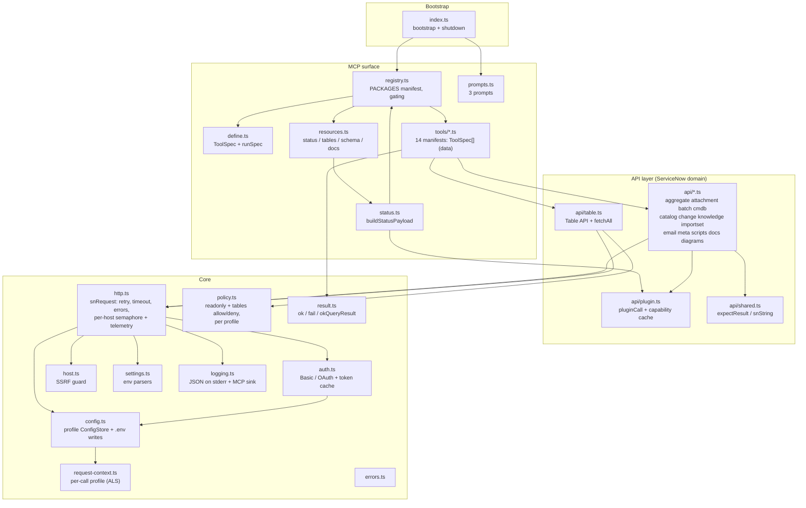
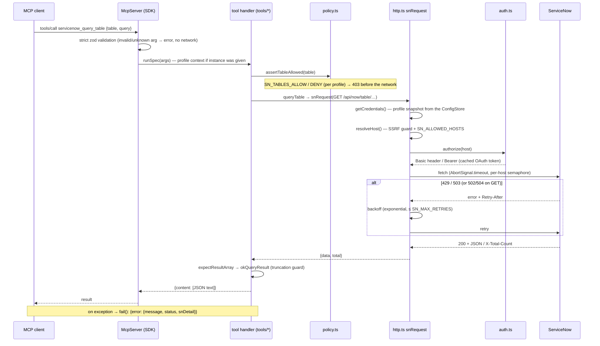
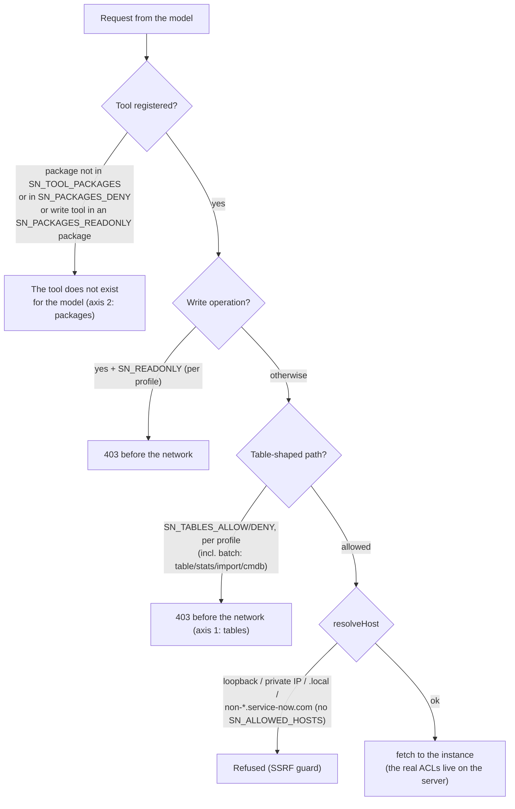
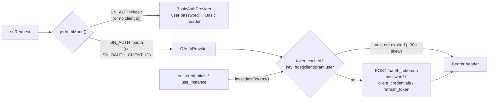
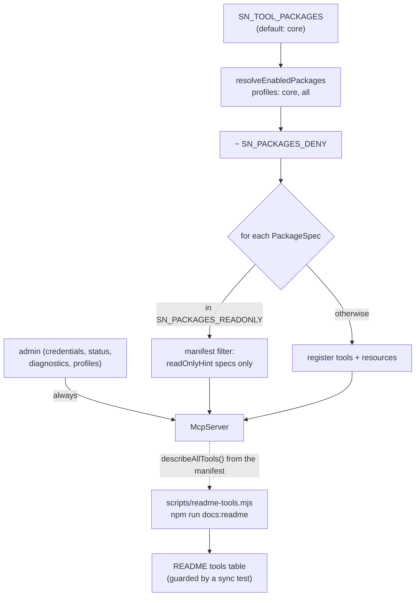

# servicenow-mcp — Architecture

Date: 2026-06-12 (night) · Reflects the code after Phase 6, the triple-analysis backlog and the Phase 7 core (137/137 tests).
Related documents: [PRODUCT-STATE.md](PRODUCT-STATE.md) (state), [IMPLEMENTATION-PLAN.md](IMPLEMENTATION-PLAN.md) (future), [DONE.md](DONE.md) (history), [WORKLOG.md](WORKLOG.md) (chronology).

## 1. What servicenow-mcp is

A TypeScript **stdio MCP server** for ServiceNow: an LLM client (Claude, VS Code Chat, Inspector…) gets 53 tools in 15 packages over the ServiceNow REST surface — Table, Aggregate, Attachment, Import Set, Batch, Service Catalog, Change Management, Knowledge, Email, CMDB/IRE, script intelligence, Mermaid generators and local self-documentation. One process, no runtime dependencies beyond `@modelcontextprotocol/sdk`, `zod` and `dotenv`; all I/O is JSON over stdio (logs go to stderr only).

The principles that hold the design together:

1. **One HTTP client** — everything goes through `snRequest()` (auth, SSRF guard, timeout, retry, error mapping happen once).
2. **Policy in the client (defense in depth)** — restrictions (read-only, tables, packages, per-profile) are enforced _before_ the network; we do not rely on the instance's ACLs alone.
3. **The code is the source of truth** — the README tools table is generated from the registrations; a sync test fails when it drifts.
4. **Tests without a network** — the whole suite (137, incl. property-based and perf guards) runs over a mock `fetch` + an in-memory MCP transport.

## 2. Layers and modules

Notes:

- `tools/*` are **data**: each file exports `specs: ToolSpec[]` (name/docs/package/annotations/strict zod input/handler); `mcp/define.ts#runSpec` provides uniform logging/error handling and the per-call profile routing. **A package is one `PackageSpec` object** `{name, tools, resources?}` in the `PACKAGES` manifest — plugged in/out with one line, resources follow the same policy declaratively, a runtime invariant keeps the tags consistent. Domain logic lives in `api/*`.
- Layers are machine-enforced (ESLint no-restricted-imports zones, M-2); a light residual cycle `registry → tools/admin → status → registry` is fine in ESM (usages are call-time only).
- Every tool also carries an automatic optional `instance` argument (MI-3): the call runs in that profile's AsyncLocalStorage context, and everything below resolves the profile at call time — no api/ signature threads it.

## 3. Lifecycle of a request

Key details:

- **Retry matrix:** 429/503 retry for all methods; 502/504 and transport errors retry only for GET (a write's outcome is unknown → never duplicate mutations). A single 401 with a cached OAuth token forces one re-authentication. `Retry-After` is honoured both as seconds and as an HTTP date.
- **Truncated results:** `okQueryResult` halves the record set iteratively until it fits `SN_MAX_RESULT_CHARS`, with a note explaining how to narrow the query.

## 4. Security model (two axes + network guards)

- **Axis 1 — tables** (`SN_TABLES_ALLOW`/`SN_TABLES_DENY`): guards the Table API, CMDB classes, Import Set and batch sub-requests (incl. `stats`/`import`/`cmdb/instance` URLs). Per-profile overrides via `SN_PROFILE_<NAME>_TABLES_*`.
- **Axis 2 — packages** (`SN_PACKAGES_DENY`/`SN_PACKAGES_READONLY`): the only way to restrict the plugin APIs (catalog/change/knowledge…), which have no table path. A read-only package means its write tools are never registered (manifest filter on `readOnlyHint`). Batch sub-requests are mapped back to their owning package and checked against the same deny/read-only axes, so a batch cannot reach a denied plugin API or write to a read-only one.
- **Global:** `SN_READONLY` blocks all mutations (per-profile override: `SN_PROFILE_<NAME>_READONLY`); the SSRF guard has no opt-out for internal addresses.
- **Hardened for public release:** the `.env` file is written owner-only (`0600`), and a host must be `*.service-now.com` unless `SN_ALLOWED_HOSTS` is set — so a redirected or mistyped host cannot silently receive Basic credentials — on top of the SSRF guard and the X-2 elicitation confirmation.

## 5. Authentication

The password is not part of the cache key → credential changes explicitly clear the cache (`invalidateTokens()`), so a token can never outlive the secrets it was minted with. A server-side revocation (401 before TTL) recovers with exactly one forced re-auth.

## 6. Configuration

- **Env-first:** values supplied by the MCP client always win (`dotenv` with `override:false`); the `.env` file is resolved as `SN_ENV_FILE` → XDG (`~/.config/servicenow-mcp-ai/.env`) → project root.
- **Profile ConfigStore (credentials):** the environment is only the _initial_ source — the first read of a profile takes an immutable snapshot; `saveCredentials` writes the file atomically (temp + rename), updates `process.env` (for child processes) and swaps the store in a single assignment. A torn read ("new user + old password") is structurally impossible. Named profiles: `SN_PROFILE_<NAME>_*` keys; the bare keys are the `default` profile; `SN_ACTIVE_PROFILE` (or a per-call `instance` argument) selects one.
- **All settings** (timeout, retries, limits, packages, log level) are read through `settings.ts` with validating parsers and documented defaults (README env table + `.env.example`).

## 7. Tool packages and registration

The `core` profile = table + schema + aggregate + attachment (+ the always-on admin tools = 18 tools); `all` = all 14 packages (48 tools; with the always-on admin tools that is the full 53). `effectivePackages()` is the single source of truth — used by registration, the status payload and the generators.

## 8. Errors and results

- Every tool response is JSON text: `ok(data)` / `okStructured(data)` (adds structuredContent for tools with an outputSchema) / `okQueryResult(records, total)` (with truncation) / `fail(error)`.
- `fail` preserves the `ServiceNowError` structure: `{ error: { message, status, snDetail } }` — the model reacts differently to 401 (credentials), 403 (policy/ACL), 429 (rate limit).
- `pluginCall` translates ServiceNow's most misleading error: a 404 for a whole namespace (= inactive plugin) is distinguished from a 404 for a missing record; the namespace variant is cached for 5 minutes (fail-fast, no network) and surfaces as `pluginApis` in the status payload.

## 9. Test architecture

| Level                | Files                                                                                                                                                                                                        | What it protects                                                                     |
| -------------------- | ------------------------------------------------------------------------------------------------------------------------------------------------------------------------------------------------------------ | ------------------------------------------------------------------------------------ |
| Pure unit            | `config.test`, `settings.test`, `result.test`, `logging.test`, `servicenow.test` (host), `profiles.test`                                                                                                     | env parsers, .env round-trip, truncation + perf, SSRF, log filter, profiles          |
| api/ over mock fetch | `http.test`, `http-retry.test`, `fetchall.test`, `auth.test`, `batch.test`, `phase3.test`, `scripts.test`, `meta.test`, `attachment.test`, `diagrams.test`, `plugin.test`, `config-store.test`, `email.test` | domain logic + retry/policy/caches/telemetry, zero network                           |
| MCP surface          | `mcp-smoke.test` (SDK Client + `InMemoryTransport`)                                                                                                                                                          | zod schemas, argument mapping, envelopes, package gating, **core contract snapshot** |
| Documentation guards | `readme-sync.test`, `manifest-snapshot.test`, `packages.test`                                                                                                                                                | README ↔ code sync; manifest fixture; package resolution                             |
| Property-based       | `property.test` (fast-check)                                                                                                                                                                                 | the env and base64 codecs over arbitrary inputs                                      |

Shared helpers (`test/helpers.js`): `baselineEnv` / `withEnv` (env snapshot/restore + ConfigStore reload), `withFetch` (global fetch swap with recorded calls), `jsonResponse`.

## 10. Key design decisions (condensed ADRs)

| #   | Decision                                                    | Why                                                                             | Alternative (rejected)                                   |
| --- | ----------------------------------------------------------- | ------------------------------------------------------------------------------- | -------------------------------------------------------- |
| 1   | stdio transport, stdout reserved for the protocol           | the simplest integration with MCP clients                                       | HTTP transport — planned as optional (X-8)               |
| 2   | Policy in the client, before the network                    | defense in depth + clear errors without hammering the instance                  | relying on server-side ACLs alone                        |
| 3   | Package policy axis via (non-)registration of specs         | an invisible tool is the safest tool; zero checks in handlers                   | runtime checks in every handler                          |
| 4   | ConfigStore snapshot for credentials (now per profile)      | atomicity + the anchor for profiles                                             | a full store for all SN\_\* upfront (double refactoring) |
| 5   | Namespace-404 cache in `pluginCall`                         | the same status code also means "no record" — only proven API absence is cached | caching every 404 (would lock out valid APIs)            |
| 6   | README table generated from the registrations               | the code is the truth; a sync test stops drift                                  | a manual table (it kept drifting)                        |
| 7   | `node:test` + mock fetch, no network                        | speed (~1 s), determinism, CI without secrets                                   | vitest (an option), e2e against a PDI (optional)         |
| 8   | PackageSpec manifest: package = tools + resources, 1 object | plug-in modularity; gating and docs read one truth                              | imperative register functions (deleted)                  |
| 9   | Per-host semaphore/telemetry, caches keyed by instance      | Phase 7 profiles arrive without refactoring; one instance cannot starve another | global counters (replaced)                               |
| 10  | Per-call profile via AsyncLocalStorage                      | no api/ signature threads a profile; everything resolves it at call time        | threading a profile argument through 20+ functions       |

## 11. What is next architecturally

Described in detail in [IMPLEMENTATION-PLAN.md](IMPLEMENTATION-PLAN.md): **Phase 7 remainder** — instance metadata snapshot to the docs store (MI-6), dev↔prod comparison (MI-7), per-profile resources (MI-8); **Phase 8** — flow intelligence, ATF runs, local lint of instance code; **optional** — HTTP transport (X-8), PDI e2e suite, Export API.
