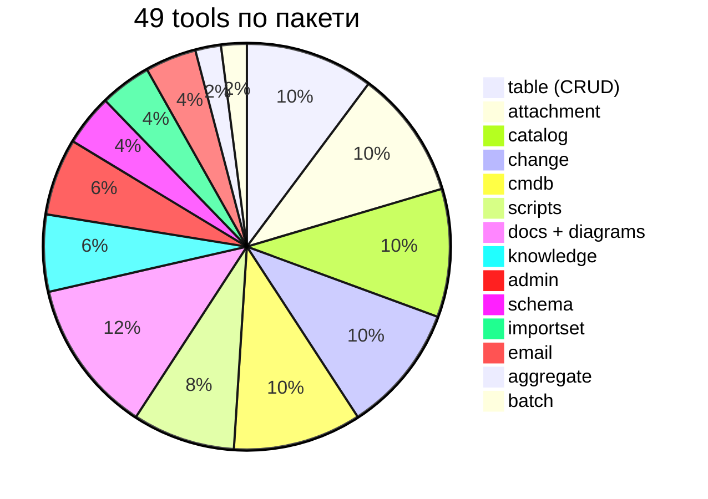
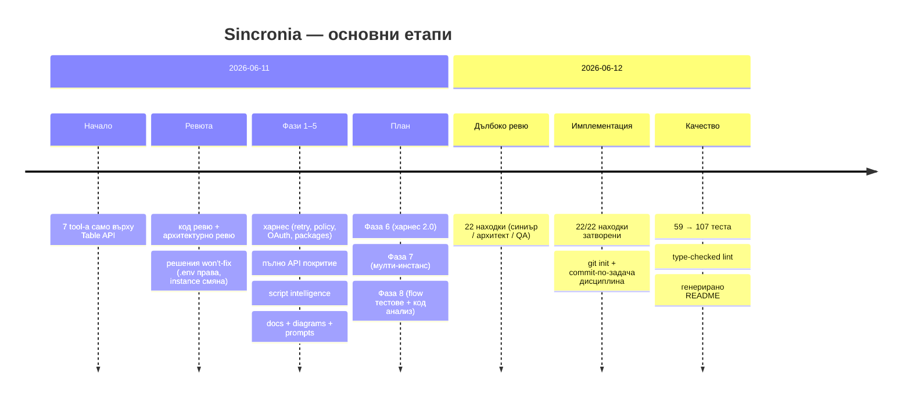

# Sincronia — Състояние на продукта

Дата: 2026-06-12 (вечер) · build чист · ESLint чист (type-checked + слоеви граници) · **137/137 теста** · CI: Node 20/22/24 матрица + coverage праг · git история commit-по-задача.
**Фаза 6 е завършена** (без изрично опционалния Х-8 HTTP транспорт): слоести директории core/api/mcp/tools, декларативен tool манифест (пакет = plug-in), elicitation, MCP logging, outputSchema, email пакет.
Свързани документи: [ARCHITECTURE.md](ARCHITECTURE.md) (как е устроено), [DONE.md](DONE.md) (пълен списък свършено), [IMPLEMENTATION-PLAN.md](IMPLEMENTATION-PLAN.md) (какво предстои), [WORKLOG.md](WORKLOG.md) (хронология), [CHANGELOG.md](CHANGELOG.md).

## 1. TL;DR — какво работи днес

Пълноценен ServiceNow MCP сървър: **49 инструмента в 14 пакета**, 5 MCP resources (пакетно гейтнати), 3 prompts. Покрива всички основни ServiceNow REST API-та (Table, Aggregate, Attachment, Import Set, Batch, CMDB/IRE) и plugin API-тата (Catalog, Change, Knowledge) с capability detection. Чете и анализира скриптовата автоматика на инстанцията (business rules, script includes, client scripts…), генерира Mermaid диаграми и поддържа локална Markdown само-документация. Двуосов policy модел (таблици + пакети), OAuth/Basic, retry/backoff, SSRF guard, structured errors.

## 2. Покритие на ServiceNow API повърхността

| ServiceNow API                     | Статус | Как                                                                   |
| ---------------------------------- | :----: | --------------------------------------------------------------------- |
| Table API (CRUD + заявки)          |   ✅   | `table` пакет; fetchAll пагинация, X-Total-Count, display values      |
| Aggregate / Stats                  |   ✅   | `servicenow_aggregate`: count/avg/min/max/sum + group_by/having       |
| Attachment                         |   ✅   | списък/мета/download/upload/delete; base64, size guard преди download |
| Import Set                         |   ✅   | staging insert + резултат от transform                                |
| Batch (`/api/now/v1/batch`)        |   ✅   | няколко REST извиквания в една заявка; policy per под-заявка          |
| CMDB Instance / Meta / IRE         |   ✅   | class-aware CRUD през Identification & Reconciliation                 |
| Service Catalog (`sn_sc`)          |   ✅   | браузване + variables + **order now**; plugin-aware                   |
| Change Management (`sn_chg_rest`)  |   ✅   | typed create (normal/standard/emergency), conflicts, update           |
| Knowledge (`sn_km_api`)            |   ✅   | релевантно търсене, статия, featured/most-viewed                      |
| Схема (`sys_db_object/dictionary`) |   ✅   | list/describe **с наследяване по super_class веригата**               |
| Скриптове (през Table API)         |   ✅   | 9 типа артефакти: списък/източник/търсене в кода/`table_logic`        |
| Диаграми / документация            |   ✅   | Mermaid ER + table flow; локален MD магазин + resources               |
| Email API                          |   ✅   | `email` пакет: send (pluginCall + write policy) / get                 |
| CI/CD + ATF                        |   📋   | планирано — Фаза 8 FT-4                                               |
| Code Search (`sn_codesearch`)      |   📋   | планирано — Фаза 8 FT-7 (fallback-ът през LIKE работи днес)           |
| Мулти-инстанс работа               |   📋   | планирано — Фаза 7 (профили, снапшот, сравнение)                      |

## 3. Как е направено (качество и инфраструктура)

- **Език/runtime:** TypeScript strict + `noUncheckedIndexedAccess`, ESM, Node ≥ 20 (внимание: default shell Node тук е v12 — ползвай nvm 22), MCP SDK 1.29.
- **Линт:** typescript-eslint type-checked + `no-floating-promises`; Prettier.
- **Тестове: 131 в 4 нива** (unit → api върху mock fetch → in-memory MCP клиент → документационни пазачи), под 1 секунда, нула мрежа. Контрактен snapshot пази tool списъка на `core`; README sync тест пази документацията.
- **CI:** GitHub Actions (lint + format + build + test, Node 20/22/24; coverage праг `--lines 85`).
- **Документация като код:** README Tools таблицата се генерира (`npm run docs:readme`); env референция + `.env.example` поддържани по работно правило; WORKLOG/DONE/TODO дисциплина след всяка задача.

## 4. История — как стигнахме дотук

Най-важните поправки от ревюто (пълен списък в [DONE.md](DONE.md)): `describe_table` вече вижда наследените колони (критично за всяка разширена таблица като `incident`); batch не заобикаля table policy през stats/import/cmdb URL-и; plugin API-тата имат capability кеш; креденшълите са в атомарен ConfigStore; per-package policy ос за plugin API-тата.

## 5. Какво НЕ е направено (пътна карта)

Подробните спецификации са в [IMPLEMENTATION-PLAN.md](IMPLEMENTATION-PLAN.md) — писани като handoff за Opus 4.8:

| Фаза                              | Какво                                                                                                                                                                           | Обем       | Ключови задачи                                        |
| --------------------------------- | ------------------------------------------------------------------------------------------------------------------------------------------------------------------------------- | ---------- | ----------------------------------------------------- |
| **6 · Харнес 2.0**                | декларативен tool манифест, директории core/api/mcp, elicitation за креденшъли, MCP logging capability, outputSchema, email пакет, оптимизации (схема-кеш, семафор, телеметрия) | ~3½–4 дни  | М-1…М-6, Х-2…Х-8, О-1…О-5 (Х-1 SDK ъпгрейдът е готов) |
| **7 · Мулти-инстанс**             | именувани профили в .env, ALS контекст, per-profile policy, снапшот на метаданни, сравнение dev↔prod                                                                            | ~2 дни     | MI-1…MI-8 (стъпва на манифеста + ConfigStore ✅)      |
| **8 · Flow тестове + код анализ** | trace на таблични събития, Flow Designer четене, ATF изпълнение, локален lint на инстанс скриптове                                                                              | ~2–3 дни   | FT-1…FT-7                                             |
| Опционално                        | PDI e2e suite, Export API (CSV/XLSX), HTTP транспорт, vitest миграция                                                                                                           | при заявка | секция „Опционално“ в плана                           |

## 6. Известни ограничения и съзнателни решения

- **Won't-fix (решения на собственика):** `.env` се пише с права 0644; `set_credentials` може да сменя хоста (SSRF guard + `SN_ALLOWED_HOSTS` остават; Х-2 ще добави клиентска конфирмация).
- **Table policy ≠ plugin policy:** deny на таблица не спира plugin API-тата — затова съществува пакетната ос (`SN_PACKAGES_DENY`/`SN_PACKAGES_READONLY`); документирано в README security секцията.
- **README env таблицата** е още ръчна (tools таблицата вече не е) — остатъкът от М-5.
- **Една инстанция наведнъж** до Фаза 7; **никакво изпълнение на код върху инстанцията** (вкл. background scripts) — ATF през официалния CI/CD API е планираният път.

## 7. Документен компас

| Файл                                             | Какво съдържа                                                       |
| ------------------------------------------------ | ------------------------------------------------------------------- |
| [README.md](README.md)                           | setup, env референция, генерирана tools таблица, примери, security  |
| [ARCHITECTURE.md](ARCHITECTURE.md)               | слоеве, диаграми, policy/auth/config модели, ADR решения            |
| [PRODUCT-STATE.md](PRODUCT-STATE.md)             | този файл — какво/докъде/как                                        |
| [IMPLEMENTATION-PLAN.md](IMPLEMENTATION-PLAN.md) | Фази 6–8 спецификации за Opus 4.8 + опционално                      |
| [DONE.md](DONE.md)                               | пълен списък свършено, с commit референции                          |
| [TODO.md](TODO.md)                               | бек лог (троен анализ S2/A2/Q2), release чеклист R-1…R-9, won't-fix |
| [WORKLOG.md](WORKLOG.md)                         | подробна хронология: проблем/решение/алтернативи/верификация        |
| [CHANGELOG.md](CHANGELOG.md)                     | потребителски преглед на промените (Keep a Changelog)               |
