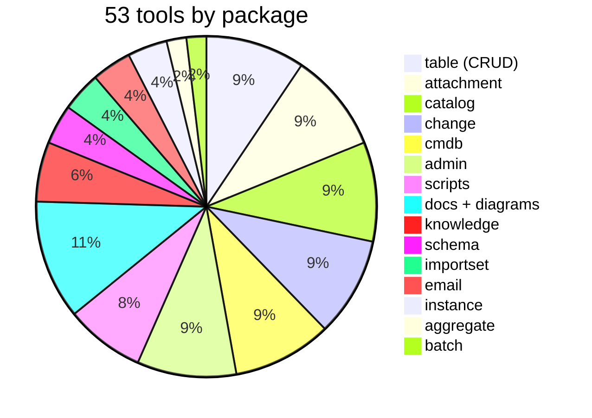
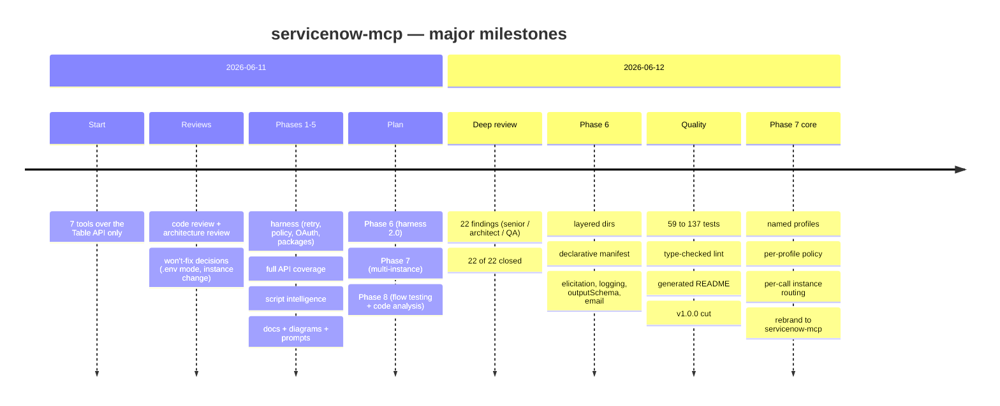

# servicenow-mcp — Product State

Date: 2026-06-13 · clean build · clean ESLint (type-checked + layer boundaries) · **173/173 tests** (coverage 93.1% lines / 80.2% branches / 69.0% functions) · CI: Node 20/22/24 + macOS matrix, coverage (lines 85 / branches 72 / functions 60) + prod-audit gates · git history one-commit-per-task.
**Phase 6 is complete** (except the explicitly optional X-8 HTTP transport): layered core/api/mcp/tools directories, a declarative tool manifest (a package is a plug-in), elicitation, MCP logging, outputSchema, the email package. **Phase 7 (multi-instance) is complete** (MI-1…MI-8: profiles, per-profile policy, per-call routing, snapshot, comparison, per-profile resources).
Related documents: [ARCHITECTURE.md](ARCHITECTURE.md) (how it is built), [DONE.md](DONE.md) (everything completed), [IMPLEMENTATION-PLAN.md](IMPLEMENTATION-PLAN.md) (what is next), [WORKLOG.md](WORKLOG.md) (chronology), [CHANGELOG.md](CHANGELOG.md).

## 1. TL;DR — what works today

A full ServiceNow MCP server: **53 tools in 15 packages**, 6 MCP resources (package-gated), 3 prompts. Covers all core ServiceNow REST APIs (Table, Aggregate, Attachment, Import Set, Batch, CMDB/IRE) and the plugin APIs (Catalog, Change, Knowledge, Email) with capability detection. Reads and analyses the instance's script automation (business rules, script includes, client scripts…), generates Mermaid diagrams and maintains a local Markdown self-documentation store. Two-axis policy model (tables + packages), named connection profiles with per-call routing, OAuth/Basic, retry/backoff, SSRF guard, structured errors.

## 2. ServiceNow API surface coverage

| ServiceNow API                      | Status | How                                                                                                                                       |
| ----------------------------------- | :----: | ----------------------------------------------------------------------------------------------------------------------------------------- |
| Table API (CRUD + queries)          |   ✅   | `table` package; fetchAll pagination, X-Total-Count, display values                                                                       |
| Aggregate / Stats                   |   ✅   | `servicenow_aggregate`: count/avg/min/max/sum + group_by/having                                                                           |
| Attachment                          |   ✅   | list/meta/download/upload/delete; base64, size guard before download                                                                      |
| Import Set                          |   ✅   | staging insert + transform outcome                                                                                                        |
| Batch (`/api/now/v1/batch`)         |   ✅   | several REST calls in one request; policy per sub-request                                                                                 |
| CMDB Instance / Meta / IRE          |   ✅   | class-aware CRUD through Identification & Reconciliation                                                                                  |
| Service Catalog (`sn_sc`)           |   ✅   | browsing + variables + **order now**; plugin-aware                                                                                        |
| Change Management (`sn_chg_rest`)   |   ✅   | typed create (normal/standard/emergency), conflicts, update                                                                               |
| Knowledge (`sn_km_api`)             |   ✅   | relevance search, article, featured/most-viewed                                                                                           |
| Schema (`sys_db_object/dictionary`) |   ✅   | list/describe **with super_class inheritance chain**                                                                                      |
| Scripts (via the Table API)         |   ✅   | 9 artefact types: list/source/code search/`table_logic`                                                                                   |
| Diagrams / documentation            |   ✅   | Mermaid ER + table flow; local MD store + resources                                                                                       |
| Email API                           |   ✅   | `email` package: send (pluginCall + write policy) / get                                                                                   |
| Multi-instance work                 |   ✅   | profiles + per-profile policy + per-call routing (MI-1…MI-5); `snapshot_instance`, `compare_instances`, per-profile resources (MI-6…MI-8) |
| CI/CD + ATF                         |   📋   | planned — Phase 8 FT-4                                                                                                                    |
| Code Search (`sn_codesearch`)       |   📋   | planned — Phase 8 FT-7 (the LIKE fallback works today)                                                                                    |

## 3. How it is built (quality and infrastructure)

- **Language/runtime:** TypeScript strict + `noUncheckedIndexedAccess`, ESM, Node ≥ 20 (note: the default shell Node here is v12 — use nvm 22), MCP SDK 1.29.
- **Lint:** typescript-eslint type-checked + `no-floating-promises` + layer-boundary rules; Prettier (checked in CI).
- **Tests: 173 on 4 levels** (unit → api over mock fetch → in-memory MCP client → documentation guards, incl. property-based and perf guards), ~1 second, zero network. A contract snapshot protects the `core` tool list; sync tests protect the README tools table and the package description counts.
- **CI:** GitHub Actions (lint + format + build + test on Node 20/22/24 Linux + Node 22 macOS; coverage gate `--lines 85 --branches 72 --functions 60`; prod-dependency audit; Windows visibility job; Node 12 launcher probe). Locally the same chain is one command: `npm run check`.
- **Documentation as code:** the README tools table is generated (`npm run docs:readme`); the env reference + `.env.example` are maintained by working rule; WORKLOG/DONE/TODO discipline after every task.

## 4. History — how we got here

The most important review fixes (full list in [DONE.md](DONE.md)): `describe_table` now sees inherited columns (critical for any extended table such as `incident`); batch can no longer bypass the table policy via stats/import/cmdb URLs; plugin APIs have a capability cache; credentials live in an atomic ConfigStore; a per-package policy axis covers the plugin APIs.

## 5. What is NOT done (roadmap)

Detailed specifications live in [IMPLEMENTATION-PLAN.md](IMPLEMENTATION-PLAN.md) — written as a handoff spec:

| Phase                                | What                                                                                 | Effort     | Key tasks                          |
| ------------------------------------ | ------------------------------------------------------------------------------------ | ---------- | ---------------------------------- |
| **8 · Flow testing + code analysis** | table-event tracing, Flow Designer reading, ATF runs, local lint of instance scripts | ~2–3 days  | FT-1…FT-7                          |
| Optional                             | PDI e2e suite, Export API (CSV/XLSX), HTTP transport (X-8), vitest migration         | on request | the "Optional" section in the plan |

## 6. Known limitations and deliberate decisions

- **Won't-fix (owner's decisions):** `.env` is written with mode 0644; `set_credentials` can change the host (the SSRF guard + `SN_ALLOWED_HOSTS` stay; X-2 elicitation adds client confirmation).
- **Table policy ≠ plugin policy:** denying a table does not stop the plugin APIs — that is what the package axis (`SN_PACKAGES_DENY`/`SN_PACKAGES_READONLY`) is for; documented in the README security section.
- **The README env table** is still manual (the tools table no longer is) — the remainder of M-5.
- **No code execution on the instance** (incl. background scripts) — ATF through the official CI/CD API is the planned path (Phase 8).

## 7. Document compass

| File                                             | Contents                                                                 |
| ------------------------------------------------ | ------------------------------------------------------------------------ |
| [README.md](README.md)                           | setup, env reference, generated tools table, examples, security          |
| [ARCHITECTURE.md](ARCHITECTURE.md)               | layers, diagrams, policy/auth/config models, ADR decisions               |
| [PRODUCT-STATE.md](PRODUCT-STATE.md)             | this file — what/how far/how                                             |
| [IMPLEMENTATION-PLAN.md](IMPLEMENTATION-PLAN.md) | Phase 6–8 specifications + optional items                                |
| [DONE.md](DONE.md)                               | everything completed, with commit references                             |
| [TODO.md](TODO.md)                               | backlog (triple analysis S2/A2/Q2), release checklist R-1…R-9, won't-fix |
| [WORKLOG.md](WORKLOG.md)                         | detailed chronology: problem/solution/alternatives/verification          |
| [CHANGELOG.md](CHANGELOG.md)                     | user-facing change overview (Keep a Changelog)                           |
