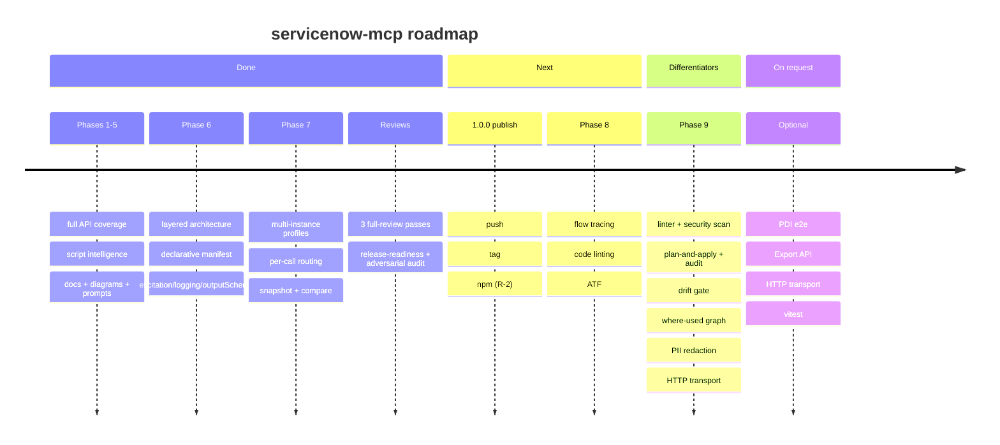

# servicenow-mcp — Roadmap

Date: 2026-06-19 · Status: **release-ready** (236/236 tests, coverage 95/82/99, full REST coverage, every auth method, Phases 1–8 complete).
This is the forward-looking view. Full task specifications live in
[IMPLEMENTATION-PLAN.md](IMPLEMENTATION-PLAN.md); completed work with commit refs is in
[DONE.md](DONE.md); the current state is in [PRODUCT-STATE.md](PRODUCT-STATE.md).

## Where we are

- **Shipped (Phases 1–8):** 65 tools in 18 packages over the full ServiceNow REST surface
  (Table, Aggregate, Attachment, Import Set, Batch, CMDB/IRE, Catalog, Change, Knowledge, Email),
  script intelligence, Mermaid generators, a local self-documentation store, a two-axis policy
  model, named multi-instance profiles with per-call routing, OAuth/Basic, retry/backoff, an SSRF
  guard, and a single enforced quality gate (`npm run check`).
- **Hardened (2026-06-17 review):** `fetchAll` truncation is visible to snapshot/compare; the
  `result`-envelope unwrap is uniform; the Batch API obeys the package axis and rejects
  path-traversal bypasses; `.env` is written `0600`; a host must be `*.service-now.com` unless
  `SN_ALLOWED_HOSTS` is set.

## Now — ship 1.0.0 (owner action R-2)

The code is release-ready; publishing is a human checklist (see [TODO.md](TODO.md) → R-2):

- [ ] Commit the uncommitted full-review + hardening work.
- [ ] Choose the version — re-point the unpushed `v1.0.0` tag onto the new HEAD (never published, so
      reusing 1.0.0 is fine) or bump to 1.1.0; move the CHANGELOG `[Unreleased]` block under it.
- [ ] Make the GitHub repo **public** (required for `npm publish --provenance`) and add the
      **`NPM_TOKEN`** repo secret.
- [ ] `git push origin main`, confirm the first CI run is green (drop the Windows `continue-on-error`
      once it is), then push the tag to fire `publish.yml`.

## Done — Phase 8 · Logical flow testing + code checking (2026-06-19)

> _"Run logical tests on different flows and check the code."_ **Shipped:** the `flows` package
> (`trace_table_event`, `list_flows`/`get_flow`, `get_flow_runs`), the `codecheck` package
> (`lint_script`/`lint_table` over a local rule set, `code_health`), the `atf` package
> (`list`/`run`/`get` via the CI/CD API — opt-in, non-default; the run tools execute on the
> instance), and FT-7 (`search_code` uses `sn_codesearch` when `SN_CODESEARCH=true`, LIKE fallback).
> 12 new tools (65 total, 18 packages), 22 new tests (219 total), gate green. New packages are
> **not** in the default `core` profile — enable with `SN_TOOL_PACKAGES`. Full specs:
> [IMPLEMENTATION-PLAN.md](IMPLEMENTATION-PLAN.md) §8.

Recommended order (highest value first):

| #   | Task                                                    | Package     | Notes                                                          |
| --- | ------------------------------------------------------- | ----------- | -------------------------------------------------------------- |
| 1   | **FT-2** · `trace_table_event` — deterministic flow sim | `flows`     | Highest value, zero new APIs; builds on `tableLogic` + Mermaid |
| 2   | **FT-1** · `list_flows` / `get_flow` (Flow Designer)    | `flows`     | Structured view of `sys_hub_flow` (+ legacy workflows)         |
| 2   | **FT-3** · `get_flow_runs` — execution evidence         | `flows`     | `sys_flow_context`/`sys_flow_log`; closes the FT-2 loop        |
| 3   | **FT-5** · `lint_script` / `lint_table` — local rules   | `codecheck` | Deterministic regex rules in pure TS, no new dependency        |
| 3   | **FT-6** · `code_health(scope?)` — aggregate report     | `codecheck` | Writes `docs/instance/<profile>/code-health.md`                |
| 4   | **FT-4** · ATF runs via the CI/CD API                   | `atf`       | Executes on the instance; needs a PDI with the plugin + roles  |
| 5   | **FT-7** · Code Search upgrade (`sn_codesearch`)        | `scripts`   | Optional; LIKE fallback stays                                  |

- [x] **FT-2** — ordered execution chain (display → before BRs → engines → after → async + flows +
      notifications/events) with conditions and an optional Mermaid flowchart.
- [x] **FT-1** — `list_flows` (metadata) + `get_flow` (parsed trigger/steps/subflows); legacy
      `wf_workflow`/`wf_activity` via `kind: "workflow"`.
- [x] **FT-3** — flow run history by flow or by record; BR errors via a `syslog` prompt hint.
- [x] **FT-5** — rule set: `hardcoded-sys-id`, `gr-unbounded-query`, `query-in-loop`,
      `current-update-in-br`, `set-workflow-false`, `eval-usage`, `gs-sleep`, `gs-log-deprecated`,
      `hardcoded-instance-url`, client `gr-on-client` / `sync-get-reference`; optional `new Function`
      syntax check.
- [x] **FT-6** — counts by type, active/inactive, last touched, findings by severity, top offenders.
- [x] **FT-4** — `list_atf_tests`/`_suites`, `run_atf_test`/`_suite` (POST `/api/sn_cicd/...`),
      `get_atf_result`; run tools are `readOnlyHint: false`.
- [x] **FT-7** — use `sn_codesearch` when present (probe via `pluginCall`); keep the LIKE fallback.

## Later — Phase 9 · Competitive differentiators (the lane the official MCP Server abandons)

> Positioning: the official **ServiceNow MCP Server Console** owns governed,
> production enterprise actions (paid Now Assist SKU, metered, on-instance). It
> structurally does **not** serve developers and consultants who need to
> _understand and safely change_ an instance — any instance, including a free
> PDI, with the model and client of their choice. Phase 9 widens exactly that
> lane: the "win where they can't follow" set.

| Key      | Item                                                    | Status / builds on                                 |
| -------- | ------------------------------------------------------- | -------------------------------------------------- |
| **DF-0** | Capability preflight + recommended read-role profile    | New; **precondition** for DF-1/DF-4 (see R1/R2)    |
| **DF-1** | Instance linter + security scan                         | Phase 8 **FT-5/FT-6** + new security rules         |
| **DF-2** | Plan-and-apply: dry-run write preview + local audit log | New; builds on the write policy + X-2 elicitation  |
| **DF-3** | Cross-instance drift gate (CI report, deployment risk)  | New; extends **MI-6/MI-7** (`snapshot`/`compare`)  |
| **DF-4** | Where-used: reference & impact graph                    | New; extends the ER / `tableLogic` script reads    |
| **DF-5** | Field-level redaction before results reach the model    | New; client-side PII guard for BYO-model privacy   |
| **DF-6** | HTTP transport (= **X-8**, promoted)                    | Bridge to the official MCP **Client** app + remote |

- [ ] **DF-0** — capability preflight (an admin tool + a `servicenow://capabilities`
      resource): on connect, probe which `sys_*` artefact tables the connected user
      can actually read and return an "achievable capabilities" map, so the script
      intelligence / linting tools never promise reads the user cannot make. The
      moat (DF-1/DF-4) depends on reading admin-restricted `sys_script*` /
      `sys_security_acl` rows that a least-privilege user often cannot; ship a
      documented **recommended read-role profile** (the minimal roles for script
      intelligence) and have DF-1/DF-4 degrade gracefully — "N artefacts unreadable
      (needs role X)" — rather than returning a silently empty report. Closes the
      permission paradox in [COMPETITIVE-ANALYSIS.md](COMPETITIVE-ANALYSIS.md) R1/R2.
- [ ] **DF-1** — fold a security dimension into `code_health`: world-/role-open
      ACLs, tables with no ACL, public Scripted REST/pages, admin-overlap roles,
      `eval`/`gs.getUser()` in ACL scripts. Ships in the `codecheck` package next
      to the FT-5 code-quality rules; one aggregated `code-health.md` covers both.
- [ ] **DF-2** — a "plan" mode for every write tool: resolve the target and
      return a structured before/after diff **without** mutating, gated by
      `apply: true` (default via `SN_WRITE_MODE=plan|apply`). Every executed
      mutation is appended to a local, append-only journal
      (`docs/instance/<profile>/write-journal.{md,jsonl}`) — a client-side audit
      trail where there is no AICT. Pairs with the existing X-2 elicitation.
- [ ] **DF-3** — promote `compare_instances` to a release artifact: one drift
      report (tables/columns/scripts by SHA-256/plugins) with a non-zero exit
      signal for CI, plus an update-set / deployment-risk preview ("what this set
      changes in the target") and an instance-vs-its-own-past diff from snapshot
      history.
- [ ] **DF-4** — `where_used(table|field|script)`: a cross-artefact reference
      graph (business rules → tables/fields, script-include call graph, fields
      referenced in rules/UI policies) rendered as JSON + an optional Mermaid
      graph. Read-only; reuses the script-intelligence readers.
- [ ] **DF-5** — a redaction policy (`SN_REDACT_FIELDS` + built-in PII detectors:
      email, phone, national IDs) applied in `mcp/result.ts` **before** records
      are serialised for the model, so sensitive values never leave the process.
      Reported as "n fields redacted".
- [ ] **DF-6** — see **X-8** below; promoted from optional because it turns the
      server from a local-only tool into something the ServiceNow MCP **Client**
      app and remote clients can consume — competitor becomes supplier.

## Adoption — developer experience & discovery (highest leverage for uptake)

> The competitive analysis ([COMPETITIVE-ANALYSIS.md](COMPETITIVE-ANALYSIS.md) §8)
> found that uptake among programmers is capped less by features than by
> discovery, real-instance permissions and a sharp first demo. These four levers
> move that needle; **DF-0** (the permission preflight) is the fourth and lives in
> Phase 9.

- [ ] **DX-1 · Publish & be discoverable** — ship to npm (the R-2 checklist), then
      list on the **MCP Registry** and add a **Claude Code plugin / skills** bundle
      (zero-config install + slash commands), matching what the leading community
      servers already offer. Discovery and one-command install are the single
      biggest adoption lever.
- [ ] **DX-2 · Read-only by default** — flip the out-of-the-box posture to safe: a
      read-only `core` (or `SN_READONLY=true` default) with an explicit opt-in to
      writes. Developers trust an exploration tool more than a write-agent, and it
      removes the "an LLM can delete on any table out of the box" risk.
- [ ] **DX-3 · One sharp dev demo** — a README/site hero scenario + GIF for the
      10-second hook: "find every usage of this field", "what runs when I save this
      record" (`table_logic` / flow trace), and "diff dev vs prod". Show the pain
      the platform leaves unsolved.
- [ ] **DX-4 = DF-0** — capability preflight + recommended read-role profile, so the
      demo that dazzles on a PDI still delivers on a governed instance (Phase 9).

## On request — Optional (no phase)

- [ ] **Integration suite against a live PDI** — e2e behind an env gate (`SN_E2E=1` + real
      credentials), run manually/nightly, not in CI by default.
- [ ] **Export API (CSV/XLSX)** — table data via Table API content negotiation.
- [ ] **X-8 · HTTP transport** — `SN_TRANSPORT=stdio|http` in `index.ts`
      (`StreamableHTTPServerTransport`, `SN_PORT`); the code is transport-agnostic. Securing the HTTP
      endpoint is the operator's responsibility. Triggers the `mcp/transport.ts` extraction (A2-4).
- [ ] **vitest migration** — only if the `node:test` suite outgrows the runner.

## Deferred tech-debt (trigger-gated — not scheduled work)

These activate only when their trigger fires; doing them earlier is premature (see [TODO.md](TODO.md)):

- **A2-2** · unify settings into the profile ConfigStore — _trigger: a Phase 7 MI-1 follow-up._
- **A2-3** · replace global singletons (token/schema/plugin caches, telemetry) with a bootstrap
  container — _trigger: when multiple servers must share one process._
- **A2-4** · extract transport selection into `mcp/transport.ts` — _trigger: the X-8 HTTP request._
- **A2-5** · MCP resource errors are JSON content (no `isError` for resources) — _trigger: MCP
  protocol evolution._

## Guardrails (every phase)

Always-green gates, one commit per task, README/env docs kept in sync, and new tools added **only**
through the declarative manifest. Every behavioural change ships with a test in the same commit.
