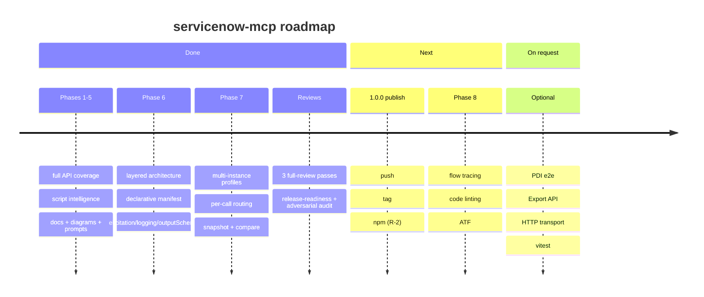

# servicenow-mcp — Roadmap

Date: 2026-06-17 · Status: **1.0.0 release-ready** (185/185 tests, full REST coverage, Phases 1–7 complete).
This is the forward-looking view. Full task specifications live in
[IMPLEMENTATION-PLAN.md](IMPLEMENTATION-PLAN.md); completed work with commit refs is in
[DONE.md](DONE.md); the current state is in [PRODUCT-STATE.md](PRODUCT-STATE.md).

## Where we are

- **Shipped (Phases 1–7):** 53 tools in 15 packages over the full ServiceNow REST surface
  (Table, Aggregate, Attachment, Import Set, Batch, CMDB/IRE, Catalog, Change, Knowledge, Email),
  script intelligence, Mermaid generators, a local self-documentation store, a two-axis policy
  model, named multi-instance profiles with per-call routing, OAuth/Basic, retry/backoff, an SSRF
  guard, and a single enforced quality gate (`npm run check`).
- **Hardened (2026-06-17 review):** `fetchAll` truncation is visible to snapshot/compare; the
  `result`-envelope unwrap is uniform; the Batch API obeys the package axis and rejects
  path-traversal bypasses; `.env` is written `0600`; a host must be `*.service-now.com` unless
  `SN_ALLOWED_HOSTS` is set.

## Now — ship 1.0.0 (owner action R-2)

The code is release-ready; publishing is a human checklist (see [TODO.md](TODO.md) → R-2):

- [ ] Commit the uncommitted full-review + hardening work.
- [ ] Choose the version — re-point the unpushed `v1.0.0` tag onto the new HEAD (never published, so
      reusing 1.0.0 is fine) or bump to 1.1.0; move the CHANGELOG `[Unreleased]` block under it.
- [ ] Make the GitHub repo **public** (required for `npm publish --provenance`) and add the
      **`NPM_TOKEN`** repo secret.
- [ ] `git push origin main`, confirm the first CI run is green (drop the Windows `continue-on-error`
      once it is), then push the tag to fire `publish.yml`.

## Next — Phase 8 · Logical flow testing + code checking (~2–3 days)

> _"Run logical tests on different flows and check the code."_ Three levels: a static view of what
> **would** run, evidence of what **did** run, and real tests (ATF). New packages: `flows` +
> `codecheck` (read-only, candidates for the `core` profile) and `atf` (never in the default —
> its run tools execute code on the instance). Ships as a **minor** release (1.x). Full specs:
> [IMPLEMENTATION-PLAN.md](IMPLEMENTATION-PLAN.md) §8.

Recommended order (highest value first):

| #   | Task                                                    | Package     | Notes                                                          |
| --- | ------------------------------------------------------- | ----------- | -------------------------------------------------------------- |
| 1   | **FT-2** · `trace_table_event` — deterministic flow sim | `flows`     | Highest value, zero new APIs; builds on `tableLogic` + Mermaid |
| 2   | **FT-1** · `list_flows` / `get_flow` (Flow Designer)    | `flows`     | Structured view of `sys_hub_flow` (+ legacy workflows)         |
| 2   | **FT-3** · `get_flow_runs` — execution evidence         | `flows`     | `sys_flow_context`/`sys_flow_log`; closes the FT-2 loop        |
| 3   | **FT-5** · `lint_script` / `lint_table` — local rules   | `codecheck` | Deterministic regex rules in pure TS, no new dependency        |
| 3   | **FT-6** · `code_health(scope?)` — aggregate report     | `codecheck` | Writes `docs/instance/<profile>/code-health.md`                |
| 4   | **FT-4** · ATF runs via the CI/CD API                   | `atf`       | Executes on the instance; needs a PDI with the plugin + roles  |
| 5   | **FT-7** · Code Search upgrade (`sn_codesearch`)        | `scripts`   | Optional; LIKE fallback stays                                  |

- [ ] **FT-2** — ordered execution chain (display → before BRs → engines → after → async + flows +
      notifications/events) with conditions and an optional Mermaid flowchart.
- [ ] **FT-1** — `list_flows` (metadata) + `get_flow` (parsed trigger/steps/subflows); legacy
      `wf_workflow`/`wf_activity` via `kind: "workflow"`.
- [ ] **FT-3** — flow run history by flow or by record; BR errors via a `syslog` prompt hint.
- [ ] **FT-5** — rule set: `hardcoded-sys-id`, `gr-unbounded-query`, `query-in-loop`,
      `current-update-in-br`, `set-workflow-false`, `eval-usage`, `gs-sleep`, `gs-log-deprecated`,
      `hardcoded-instance-url`, client `gr-on-client` / `sync-get-reference`; optional `new Function`
      syntax check.
- [ ] **FT-6** — counts by type, active/inactive, last touched, findings by severity, top offenders.
- [ ] **FT-4** — `list_atf_tests`/`_suites`, `run_atf_test`/`_suite` (POST `/api/sn_cicd/...`),
      `get_atf_result`; run tools are `readOnlyHint: false`.
- [ ] **FT-7** — use `sn_codesearch` when present (probe via `pluginCall`); keep the LIKE fallback.

## On request — Optional (no phase)

- [ ] **Integration suite against a live PDI** — e2e behind an env gate (`SN_E2E=1` + real
      credentials), run manually/nightly, not in CI by default.
- [ ] **Export API (CSV/XLSX)** — table data via Table API content negotiation.
- [ ] **X-8 · HTTP transport** — `SN_TRANSPORT=stdio|http` in `index.ts`
      (`StreamableHTTPServerTransport`, `SN_PORT`); the code is transport-agnostic. Securing the HTTP
      endpoint is the operator's responsibility. Triggers the `mcp/transport.ts` extraction (A2-4).
- [ ] **vitest migration** — only if the `node:test` suite outgrows the runner.

## Deferred tech-debt (trigger-gated — not scheduled work)

These activate only when their trigger fires; doing them earlier is premature (see [TODO.md](TODO.md)):

- **A2-2** · unify settings into the profile ConfigStore — _trigger: a Phase 7 MI-1 follow-up._
- **A2-3** · replace global singletons (token/schema/plugin caches, telemetry) with a bootstrap
  container — _trigger: when multiple servers must share one process._
- **A2-4** · extract transport selection into `mcp/transport.ts` — _trigger: the X-8 HTTP request._
- **A2-5** · MCP resource errors are JSON content (no `isError` for resources) — _trigger: MCP
  protocol evolution._

## Guardrails (every phase)

Always-green gates, one commit per task, README/env docs kept in sync, and new tools added **only**
through the declarative manifest. Every behavioural change ships with a test in the same commit.
